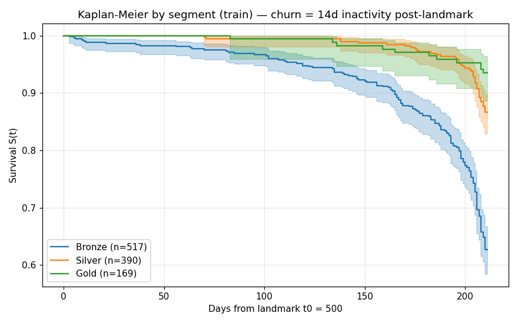
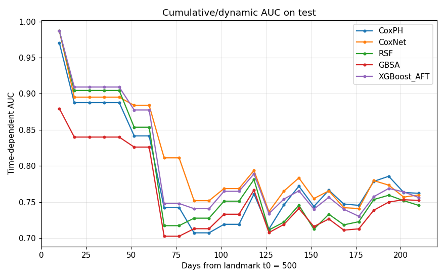
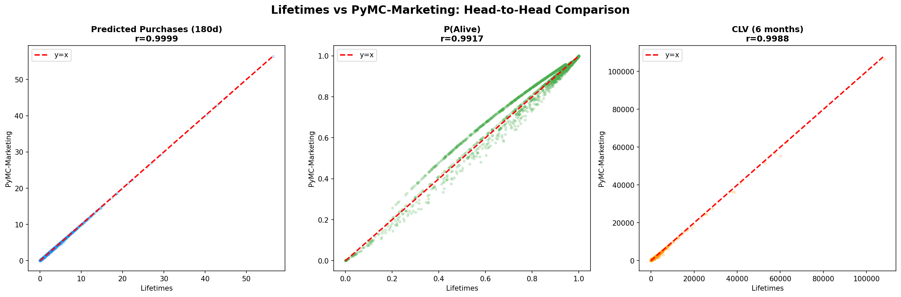

# Customer Churn Survival Analysis & CLV Prediction

[](https://github.com/josephazar/Survival_Analysis_Demo/actions/workflows/ci.yml)
[](LICENSE)
[](requirements.txt)

End-to-end customer analytics across two retail panels:

- **Online Retail II** — UK e-commerce, Dec 2009 – Dec 2011, ~5,800 customers.
- **Dunnhumby "The Complete Journey"** — US grocery, 2 years, 2,500 households, ~2.6M transactions.

Covers empirical churn-window selection, landmark survival modelling, CLV
prediction (ML vs BTYD), and a BTYD library comparison (Lifetimes vs
PyMC-Marketing) — with leakage-proof feature engineering, validation-based
model selection, and an automated invariant test suite.

## Results at a glance

| | Online Retail II | Dunnhumby |
|---|---|---|
| Churn window (empirical, Kneedle elbow) | 45 days (elbow 43d) | 14 days (elbow 16d) |
| Landmark design | 2011-06-01, 192-day follow-up | DAY 500, 211-day follow-up |
| Alive-at-landmark cohort | 1,269 / 5,878 | 1,794 / 2,500 |
| Best survival model (val-selected), test C-index | RSF **0.758** | CoxNet **0.733** (TD-AUC 0.771) |
| Early-behaviour classifier, test AUC | RandomForest **0.62** (90-day conversion) | LogReg **0.743** (eventual churn) |
| CLV benchmark winner (val-selected) | **Lifetimes** — MAE £494 (vs XGBoost £553) | **LinearRegression** — MAE $339 (vs BTYD $355) |
| Invariant tests | — | **20/20 pass** |

Two datasets, opposite CLV conclusions: on the sparse e-commerce panel the
4-parameter BTYD model beats feature-rich ML; on the dense grocery panel ML
wins. Neither result generalises without checking your data first.

<p align="center">
  
  
</p>
<p align="center">
  
</p>

## Project structure

```
├── scripts/                          # Online Retail Python pipeline (authoritative)
│   ├── 01_survival.py                # Landmark survival on the alive-at-t0 cohort
│   ├── 02_stage1.py                  # 90-day conversion classifier (val-based tuning)
│   ├── 03_scorecard.py               # Full-coverage scorecard (Cox + KM baseline)
│   └── README.md
│
├── customer-survival-analysis.ipynb  # Retrospective design, kept as an instructive contrast
├── clv-prediction-benchmark.ipynb    # ML vs BTYD (Lifetimes wins on this panel)
├── churn-window-analysis.ipynb       # Kneedle elbow → 45-day churn window
├── stage1-conversion-model.ipynb     # 90-day conversion model, temporal split
│
├── btyd_analysis/                    # BTYD library comparison (Lifetimes vs PyMC-Marketing)
│   ├── BTYD_Intro_End_to_End_Project.ipynb   # BTYD walkthrough on simulated data
│   ├── 01_data_prep.py … 04_comparison.py
│
├── survival-analysis-intro/          # 5-notebook intro course on synthetic data
│   ├── notebooks/01…05               # censoring → KM/log-rank → Cox → diagnostics → landmark project
│   └── data/                         # small synthetic CSVs
│
├── dunnhumby/                        # Dunnhumby pipeline (see dunnhumby/README.md)
│   ├── scripts/                      # 9 stages, landmark-based
│   ├── tests/test_leakage_and_smoke.py   # 20 invariant assertions
│   └── 00_EDA_and_Business_Problem.ipynb # Narrative front door
│
├── LESSONS_LEARNED.md                # Field guide: survival-modeling traps + defences
├── SURVIVAL_ANALYSIS_GUIDE.md        # Glossary for readers new to survival analysis
├── requirements.txt                  # Pinned dependencies
└── assets/                           # Plots embedded in this README
```

## Setup

```bash
python -m venv venv
source venv/bin/activate
pip install -r requirements.txt
```

**Data** (not distributed with the repo): create a `data/` folder **next to
the repo clone** (i.e. `../data/` from inside the repo) containing
`online_retail_II.csv` and a `dunnhumby/` subfolder with the Complete
Journey CSVs. Download links are in the [Data](#data) section.

## Quick start

### Online Retail II pipeline

```bash
cd scripts
python 01_survival.py     # landmark survival + persisted split
python 02_stage1.py       # 90-day conversion classifier
python 03_scorecard.py    # full-coverage conditional scorecard
```

Metrics land in `scripts/artifacts/`; the per-customer scorecard is
`scripts/artifacts/online_retail_scorecard.csv`.

### Dunnhumby pipeline

```bash
cd dunnhumby/scripts
for s in 00_data_prep 01_eda 02_churn_window_analysis 03_feature_engineering \
         04_btyd_benchmark 05_early_dropout_model 06_customer_survival_analysis \
         07_clv_prediction_benchmark 08_household_scorecard; do
  python $s.py
done
cd .. && python tests/test_leakage_and_smoke.py     # expects 20/20 passing
```

Final scorecard at `../data/household_survival_scorecard.csv`.

## The notebooks (Online Retail)

### `churn-window-analysis.ipynb`
Kneedle elbow on the inter-purchase gap CDF → 43 days → a 45-day churn
window, cross-checked with label-stability analysis across candidate
windows. Deliberately does **not** use a classifier to "validate" the
window: with recency-derived labels that exercise is circular
(see [`LESSONS_LEARNED.md`](LESSONS_LEARNED.md), item 15). The same
methodology applied to Dunnhumby yields 14 days.

### `stage1-conversion-model.ipynb`
First-invoice → will-they-convert-within-90-days classifier. 25 features,
fixed conversion horizon for all cohorts, temporal split, validation-based
early stopping and thresholds. Test AUC ≈ 0.62 (RandomForest) — first-invoice
data carries real but modest signal.

### `clv-prediction-benchmark.ipynb`
ML (Linear / RF / XGBoost, `cross_val_predict` with in-pipeline scaling)
vs probabilistic BTYD for 6-month CLV. **Lifetimes wins** (MAE £494 vs
XGBoost £553) — strong domain-specific inductive bias beats feature-rich
ML on ~5K customers.

### `customer-survival-analysis.ipynb`
The original retrospective exploration (PCA+K-Means, per-segment
Kaplan-Meier, five survival models, scorecard), kept as an instructive
contrast: its ~0.9 C-index is what a retrospective design produces, and the
banner at the top explains exactly why the landmark pipeline's 0.75 is the
honest number. The methodological deltas are spelled out inline.

### `btyd_analysis/` — Lifetimes vs PyMC-Marketing
Four-script head-to-head BG/NBD + Gamma-Gamma comparison on identical RFM
inputs. Near-identical point estimates (CLV correlation r = 0.999, top-50
overlap 96%). Lifetimes fits in ~0.05 s; PyMC's 4-chain × 1000-draw MCMC
(R-hat = 1.00, ESS > 900) takes ~15 s and buys you full posterior
uncertainty. New to BTYD? `BTYD_Intro_End_to_End_Project.ipynb` in the same
folder walks the whole frequency/recency/T → BG/NBD → Gamma-Gamma → CLV →
action-table arc on a small simulated retailer, including
calibration/holdout backtesting and the classic mistakes to avoid.

## The Dunnhumby pipeline

Nine-stage landmark pipeline with its own [README](dunnhumby/README.md) and
a [narrative EDA notebook](dunnhumby/00_EDA_and_Business_Problem.ipynb).
Highlights beyond the table above:

- **Hazard-ratio inference done separately from prediction**: an
  unpenalized Cox on a curated 9-feature subset (penalized fits don't give
  valid p-values), with the proportional-hazards assumption checked.
- **BG/NBD degeneracy detected and flagged**: on this dense loyal-shopper
  panel the fitted dropout parameter collapses (a ≈ 0.01, median p_alive
  0.9997), so `p_alive` is explicitly not used as a churn signal.
- **Model selection on validation**: CoxNet won on val C-index and is
  reported at its test C-index (0.733) even though another model happened
  to edge it on test — the protocol is the point.
- **Tests recompute features from raw data**: the leakage suite rebuilds
  key landmark features from the raw pre-t0 transactions and requires
  exact agreement (20/20 assertions).

## Methodology, in one paragraph

Both pipelines use a **landmark design**: pick a date `t0`, keep customers
*alive at t0* (inactivity ≤ churn window), build features strictly from
data on or before `t0`, and measure outcomes strictly after it — with churn
*declared* at `last_purchase + window`, and administrative censoring at the
study end. Evaluation uses IPCW C-index, time-dependent AUC, and integrated
Brier score on a locked test fold; every choice (hyperparameters, early
stopping, thresholds, winning model) is made on a validation fold. The full
list of traps this protects against — and how each is enforced in code or
tests — is in [`LESSONS_LEARNED.md`](LESSONS_LEARNED.md). If survival
analysis is new to you, start with
[`SURVIVAL_ANALYSIS_GUIDE.md`](SURVIVAL_ANALYSIS_GUIDE.md) (glossary) or
work through the hands-on notebook course in
[`survival-analysis-intro/`](survival-analysis-intro/).

## Output artefacts

**Generated, gitignored:**

- `scripts/artifacts/online_retail_scorecard.csv` — 5,878-customer scorecard with `s_source` provenance and `s_asof` anchoring
- `scripts/artifacts/online_retail_survival_metrics.json` — test metrics for all survival models
- `dunnhumby/processed/*.parquet` — canonical Dunnhumby intermediates
- `dunnhumby/artifacts/<stage>/` — per-stage plots and `metrics.json`
- `../data/household_survival_scorecard.csv` — final Dunnhumby scorecard (2,500 × 34)
- `btyd_analysis/*.parquet` / `*.png` / `*.json` — BTYD comparison artefacts

**Risk labels** used consistently across both projects:

- **Churned - Loss/Winback** — already inactive > `CHURN_WINDOW` at observation end
- **High Risk** — active but low survival probability
- **Medium Risk** — active with warning signs
- **Low Risk** — healthy active customer
- **New/Unproven** — too little history for an estimate (one-time buyers:
  BG/NBD's `p_alive` is exactly 1.0 there by construction, so it is masked
  rather than reported)

## Data

- [Online Retail II](https://archive.ics.uci.edu/dataset/502/online+retail+ii) — 1M+ transactions from a UK online retailer. After cleaning: ~780K transactions, ~5,800 customers.
- [Dunnhumby "The Complete Journey"](https://www.dunnhumby.com/source-files/) — 2-year panel of 2,500 US households, ~2.6M transactions, 92K products, 801 households with demographics, 30 campaigns.

## License

[MIT](LICENSE)
